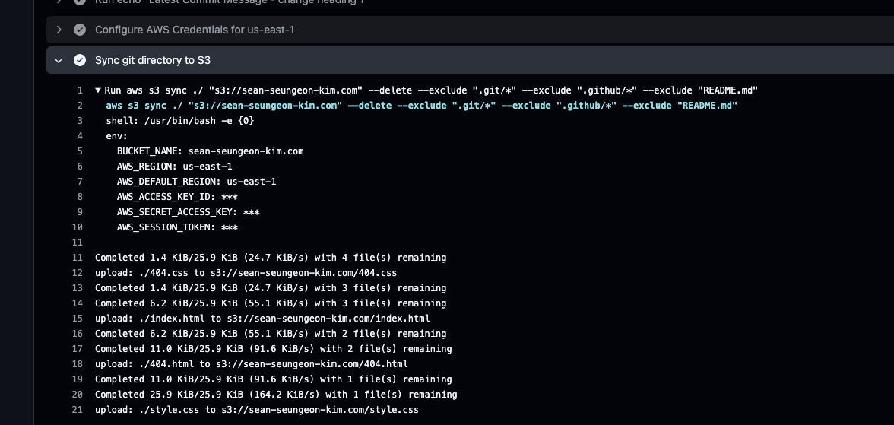
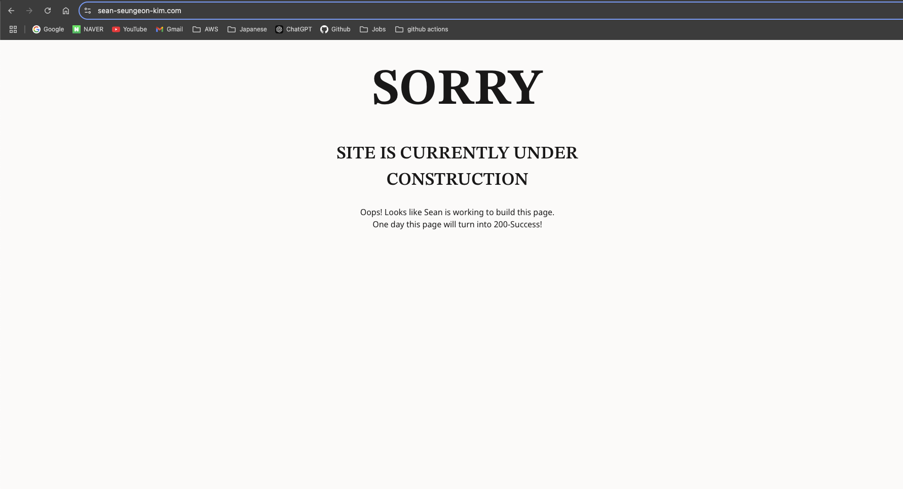

# Jan 6

## Set Up Two S3 Buckets
One contains the static files for website hosting. The other bucket is created for redirect purpose. If the user types a url without root domain, for example `domain.com` instead of `www.domain.com`, the second bucket receives the request and redirects to the first main bucket.
- For the moment, I allowed **all public access**. You should NOT do it in real production. I did it for testing purpose.
- I created a bucket policy to allow `GetObject` action for everyone
**Example Bucket Policy**
```json
{
  "Version": "2012-10-17",
  "Statement": [
    {
      "Effect": "Allow",
      "Principal": "*",
      "Action": "s3:GetObject",
      "Resource": "arn:aws:s3:::{{bucket_name}}/*"
    }
  ]
}
```

## Register Domain with Route53
I registered my domain name `sean-seungeon.com` in Route53. The pricing was $14/year, which is not bad at all!! Just save two cups of coffee from Starbucks

## Configure Route53 to S3 buckets
I create **2 A records** in my domain.

# Jan 8 2025

## Plan to Set Up Github Action
In order to automate S3 upload process, I felt a need to set up a **Github Action**. so that everytime there are changes in pages, Github triggers CI pipeline and automatically uploads to S3 bucket.

So I created a default Github Action. This should be a good starting point to think how my pipeline looks.

First, I added a .yaml file under `./github/workflows`. Each yaml file represents one **workflow**. I think it's similar to Jenkins pipeline.

Example yaml file

```yaml
name: GitHub Actions Demo
run-name: ${{ github.actor }} is testing out GitHub Actions 🚀
on: [push]
jobs:
  Explore-GitHub-Actions:
    runs-on: ubuntu-latest
    steps:
      - run: echo "🎉 The job was automatically triggered by a ${{ github.event_name }} event."
      - run: echo "🐧 This job is now running on a ${{ runner.os }} server hosted by GitHub!"
      - run: echo "🔎 The name of your branch is ${{ github.ref }} and your repository is ${{ github.repository }}."
      - name: Check out repository code
        uses: actions/checkout@v4
      - run: echo "💡 The ${{ github.repository }} repository has been cloned to the runner."
      - run: echo "🖥️ The workflow is now ready to test your code on the runner."
      - name: List files in the repository
        run: |
          ls ${{ github.workspace }}
      - run: echo "🍏 This job's status is ${{ job.status }}."
```

In the first workflow, I added basic steps. Just echoing things! This example shows how to use workflow syntax. `job`, `runner`, `github` etc

## Github Action Lingos I learned

- A repo can have multiple `workflows`.
- An `Event` is something that triggers workflow. An example includes code being pushed and creating a Pull Request.
	- You can also trigger dworkflow on a schedule
- A `job` is a set of `step`s on the same `runner`.
	- You can share data between steps. They are under same runner
	- You can configure job dependency. When a Job A has dependency on Job B, Job A waits for Job B to finish executing
- You can define multiple `job`s in one workflow. They all appear in Github UI.
- each job will execute on a `runner` machine and run a series of one or more `steps`
- An `Action` is a custom app that performs repetitive tasks. You can use an Action to reduce tedious work in workflow file.
	- You can create your own action or find pre-made one in Marketplace.
- Each step can either run a script that you define or run an `action`, which is a reusable extensions.


# Jan 9

## Set up OpenID Connect(OIDC) to authenticate with AWS

In order to update S3 objects, the workflow needs to be authenticated. Github recommends to use OIDC. 

Thanks to OIDC, we don't have to store AWS credentials as long-lived Github secrets. More secure way

I created an IAM Role that Workflow can consume

References:
- https://docs.github.com/en/actions/security-for-github-actions/security-hardening-your-deployments/configuring-openid-connect-in-amazon-web-services#adding-the-identity-provider-to-aws
- https://www.youtube.com/watch?v=aOoRaVuh8Lc&ab_channel=CodeMadeSimple


# Jan 12

After getting Github athenticated, I needed to grant permission to the role that Github Action assumes.

This is to enable github action to interact with S3 bucket.

I first defined a few based on the "Least Previledge Principal".

### Example IAM Role policy

```json
{
    "Version": "2012-10-17",
    "Statement": [
        {
            "Sid": "VisualEditor0",
            "Effect": "Allow",
            "Action": [
                "s3:PutObject",
                "s3:ListBucket",
                "s3:GetObject",
                "s3:DeleteObject",
            ],
            "Resource": [
                "arn:aws:s3:::sean-seungeon-kim.com/*",
                "arn:aws:s3:::sean-seungeon-kim.com"
            ]
        }
    ]
}
```

After adding policies, I tested if the automation of s3 website upload. I changed heading 1 from '404' to 'Sorry'. After pushing, the sync command worked and the page changed!



